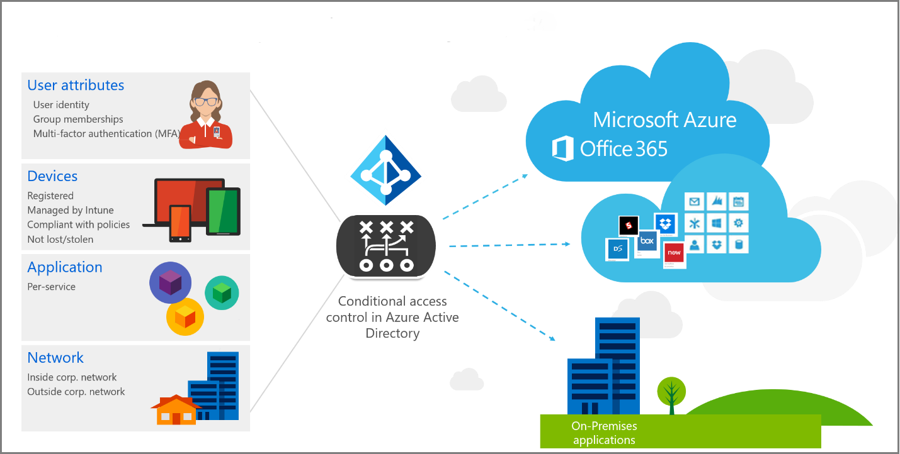

<properties
	pageTitle="Securing access to Office 365 and other apps connected to Azure Active Directory | Microsoft Azure"  
    description="With Conditional access control, Azure Active Directory checks the specific conditions you pick when authenticating the user and before allowing access to the application. Once those conditions are met, the user is authenticated and allowed access to the application."  
    services="active-directory" 
	keywords="conditional access to apps, conditional access with Azure AD, secure access to company resources, conditional access policies" 
	documentationCenter=""
	authors="femila"
	manager="stevenpo"
	editor=""/>

<tags
	ms.service="active-directory"
	ms.devlang="na"
	ms.topic="article"
    ms.tgt_pltfrm="na"
    ms.workload="identity" 
	ms.date="03/23/2016"
	ms.author="femila"/>

# Securing access to Office 365 and other apps connected to Azure Active Directory  
  
Securing access to company resources is important to every organization. With the advent of cloud services and mobile devices, the ways in which users access company resources has significantly changed. This calls for requiring changes to strategy on how to secure corporate resources.  
  
## Why conditional access?  
 The conditional access control capabilities in Azure Active Directory offers simple ways for companies to secure their resources both in the cloud and on-premises. Whether you need something like "prevent access to my resources using a stolen password" or “require a healthy, managed device for accessing my enterprise content", Azure Active Directory meets your needs.  

## How is conditional access control enforced?  
 With conditional access control, Azure Active Directory checks the specific conditions you choose when authenticating a user, before allowing access to an application. Once those conditions are met, the user is authenticated and allowed access to the application.  
   
 

## User-based access to resources
  
- **User attributes**: At the user attributes level, you can apply policies to ensure that only authorized users can access company resources.   
- **Group membership of a user**: You can also control the level of access provided to a user based on their membership to a group or groups.   
- **Multi factor authentication (MFA)**: In addition, you can also enforce policies where a  user has to authenticate his/her identify by using a multi factor authentication system. For example, you can force a user to confirm a PIN on a personal mobile phone to ensure an extra layer of security. The MFA authentication protects your resources from being accessed by an unauthorized user who has gained access to the username and password of a valid user. 

## Device based conditional access 

- **Registered devices**: At the device level, you can set policies that enforce that only registered or known devices are allowed access. In addition, you can use a Mobile Device Management (MDM) solution such as Microsoft Intune to ensure only Managed devices access your resources. The device level conditional access ensures that only devices that are compliant with your policies such as enforcing PIN on a device are allowed access. In addition, by using MDM solutions you can ensure that corporate data on a lost/stolen device can we wiped remotely.  
- **Device policies**: You can also set policies to restrict access on a per application basis only. In addition, you can also set access level based on the physical location of the device i.e. whether the request is coming from a known corporate network or outside.  

The level of access that you can set using these policies can be applied to resources in the cloud or on-premises. The resources in the cloud could be apps such as Office 365 and 3rd party SaaS apps. In addition, these could also be Line of Business apps that you have hosted on the cloud.  
  
## Conditional access - a content map  
The following content map lists documents that you need to refer to learn more about enabling conditional access in your current deployment

| Scenario                                             | Articles |
|------------------------------------------------------|----------|
| Protecting corporate resources from phishing attacks |[Getting started with conditional access to AAD SaaS apps with MFA and extranet](active-directory-conditional-access-azuread-connected-apps.md)  [Conditional access to Azure AD apps](active-directory-conditional-access-technical-reference.md)  [How to configure MFA](multi-factor-authentication-get-started-cloud.md)  [Securing cloud resources with Azure Multi-Factor Authentication and AD FS](https://technet.microsoft.com/library/dn758113.aspx)  [Per-user MFA considerations](multi-factor-authentication-end-user-manage-settings.md)  [MFA from extranet](multi-factor-authentication-get-started-adfs-cloud.md)|
| Protecting corporate data on lost/stolen devices     |[Device registration service](active-directory-conditional-access-device-registration-overview.md)   [Registering domain joined devices](active-directory-azureadjoin-setup.md)   [Using devices registered in Azure AD for on-premises conditional access](active-directory-conditional-access-on-premises-setup.md)   [Configure automatic device registration for Windows 7 domain joined devices](active-directory-conditional-access-automatic-device-registration-windows7.md)   [Configure automatic device registration for Windows 8.1 domain joined devices](active-directory-conditional-access-automatic-device-registration-windows8_1.md)   [Conditional Access Device Policies for Office 365 services](active-directory-conditional-access-device-policies.md)|
| Additional Info                                      |[Conditional Access FAQs](active-directory-conditional-faqs.md)|

