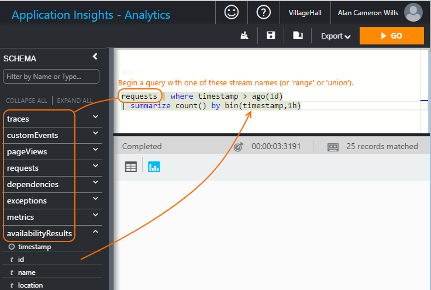
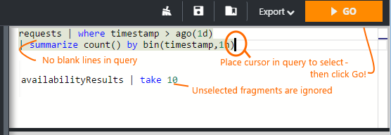
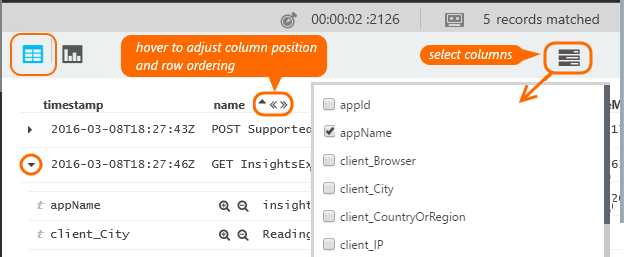
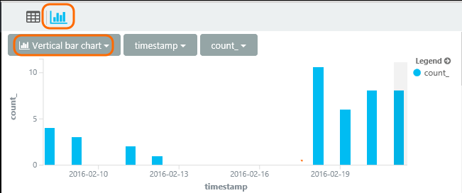
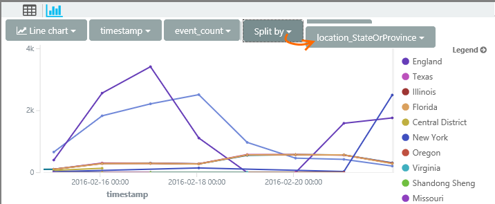
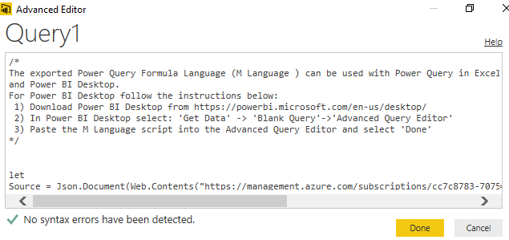
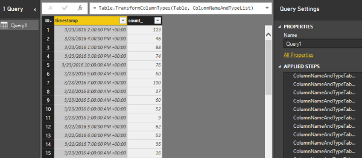

<properties 
	pageTitle="Using Analytics - the powerful search tool of Application Insights" 
	description="Using the Analytics, 
	             the powerful diagnostic search tool of Application Insights. " 
	services="application-insights" 
    documentationCenter=""
	authors="alancameronwills" 
	manager="douge"/>

<tags 
	ms.service="application-insights" 
	ms.workload="tbd" 
	ms.tgt_pltfrm="ibiza" 
	ms.devlang="na" 
	ms.topic="article" 
	ms.date="03/23/2016" 
	ms.author="awills"/>

# Using Analytics in Application Insights

[Analytics](app-analytics.md) lets you run powerful queries over the telemetry from your app collected by 
[Application Insights](app-insights-overview.md). These pages describe its query lanquage.

[AZURE.INCLUDE [app-analytics-top-index](../../includes/app-analytics-top-index.md)]

## Open Analytics

From your app's home resource in Application Insights, click Analytics.

The inline tutorial will give you some ideas about what you can do.

There's a [more extensive tour here](app-analytics-tour.md).

## Write queries

Write a query beginning with the names of any of the tables listed on the left. Use `|` to create a pipeline of [operators](app-analytics-queries.md). 

* Don't put blank lines in your query.
* You can use single line breaks in a query.
* You can keep several queries in the window, separated by blank lines.
* To run a query, **place the cursor inside or at the end of it**, and click Go.

* You can save and recall the content of the query window.

## Arranging the results

You can pick the columns you'd like to see. Expand any item to see all the returned column values.

> [AZURE.NOTE] Click the head of a column as a quick way to re-order the results available in the web browser. But be aware that for a large result set, the number of rows downloaded to the browser is limited. So, sorting this way doesn't always show you the actual highest or lowest items. For that, you should use the [top](app-analytics-queries.md#top-operator) or [sort](app-analytics-queries.md#sort-operator) operator. 

But it's good practice to use the [take](app-analytics-queries.md#take-operator), [top](app-analytics-queries.md#top-operator) or [summarize](app-analytics-queries.md#summarize-operator) operators to avoid downloading huge tables from the server. There is anyway an automatic limit of about 10k rows per query.

## Diagrams

Select the type of diagram you'd like:

If you have several columns of the right types, you can choose the x and y axes, and a column of dimensions to split the results by:

By default, results are initially displayed as a table, and you select the diagram manually. But you can use the [render directive](app-analytics-queries.md#render-directive) at the end of a query to select a diagram.

## Export to Excel

After you've run a query, you can download a .csv file. Click **Export, to Excel**.

## Export to Power BI

1. Put the cursor in a query and choose **Export to Power BI**.

    

    This downloads an M script file.

3. Copy the M Language script into the Power BI Desktop advanced query editor.
 * Open the exported file.
 * In Power BI Desktop select: **Get Data, Blank Query, Advanced Editor** and paste the M Language script.

    

4. Edit credentials if needed and now you can build your report.

    

[AZURE.INCLUDE [app-analytics-footer](../../includes/app-analytics-footer.md)]

