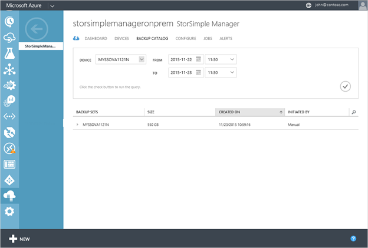

<properties 
   pageTitle="StorSimple Virtual Array backup tutorial | Microsoft Azure"
   description="Describes how to back up StorSimple Virtual Array shares and volumes."
   services="storsimple"
   documentationCenter="NA"
   authors="alkohli"
   manager="carmonm"
   editor="" />
<tags 
   ms.service="storsimple"
   ms.devlang="NA"
   ms.topic="article"
   ms.tgt_pltfrm="NA"
   ms.workload="TBD"
   ms.date="03/01/2016"
   ms.author="alkohli" />

# Back up your StorSimple Virtual Array

## Overview 

This tutorial applies to the Microsoft Azure StorSimple Virtual Array (also known as the StorSimple on-premises virtual device or StorSimple virtual device) running March 2016 general availability (GA) release.

The StorSimple Virtual Array is a hybrid cloud storage on-premises virtual device that can be configured as a file server or an iSCSI server. It can create backups, restore from backups, and perform device failover if disaster recovery is needed. When configured as a file server, it also allows item-level recovery. This tutorial describes how to use the Azure classic portal or the StorSimple web UI to create scheduled and manual backups of your StorSimple Virtual Array.

## Back up shares and volumes

Backups provide point-in-time protection, improve recoverability, and minimize restore times for shares and volumes. You can back up a share or volume on your StorSimple device in two ways: **Scheduled** or **Manual**. Each of the methods is discussed in the following sections.

> [AZURE.NOTE] In this release, scheduled backups are created by a default policy that runs daily at a specified time and backs up all the shares or volumes on the device. It is not possible to create custom policies for scheduled backups at this time.

## Change the backup schedule

Your StorSimple virtual device has a default backup policy that starts at a specified time of day (22:30) and backs up all the shares or volumes on the device once a day. You can change the time at which the backup starts, but the frequency and the retention (which specifies the number of backups to retain) cannot be changed. During these backups, the entire virtual device is backed up; therefore, we recommend that you schedule these backups for off-peak hours.

Perform the following steps in the [Azure classic portal](https://manage.windowsazure.com/) to change the default backup start time.

#### To change the start time for the default backup policy

1. Navigate to the device **Configuration** tab.

2. Under the **Backup** section, specify the start time for the daily backup.

3. Click **Save**.

### Take a manual backup

In addition to scheduled backups, you can take a manual (on-demand) backup at any time.

#### To create a manual (on-demand) backup

1. Navigate to the **Shares** tab or the **Volumes** tab.

2. At the bottom of the page, click **Backup all**. You will be prompted to verify that you would like to take the backup now. Click the check icon  to proceed with the backup.

    

    You will be notified that a backup job is starting.

    

    You will be notified that the job was created successfully.

    

3. To track the progress of the job, click the **View Job** icon.

4. After the backup job is finished, go to the **Backup catalog** tab. You should see your completed backup.

    

5. Set the filter selections to the appropriate device, backup policy, and time range, and then click the check icon .

    The backup should appear in the list of backup sets that is displayed in the catalog.

## View existing backups

Perform the following steps in the Azure classic portal to view the existing backups.

#### To view existing backups

1. On the StorSimple Manager service page, click the **Backup catalog** tab.

2. Select a backup set as follows:

    1. Select the device.

    2. In the drop-down list, choose the share or volume for the backup that you wish to select.

    3. Specify the time range.

    4. Click the check icon  to execute this query.

    The backups associated with the selected share or volume should appear in the list of backup sets.

 **Video available**

Watch the video to see how you can create shares, back up shares, and restore data on a StorSimple Virtual Array.

> [AZURE.VIDEO use-the-storsimple-virtual-array]

## Next steps

Learn more about [administering your StorSimple Virtual Array](storsimple-ova-web-ui-admin.md).